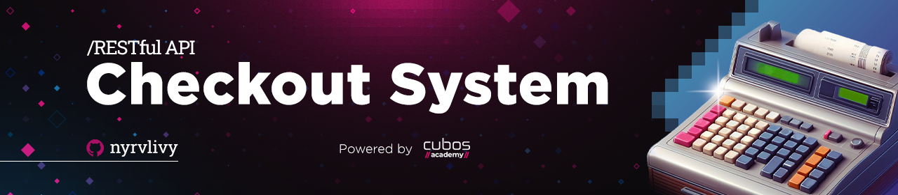

<div align="center">
  
</div>

<h1 align="center">PDV-System-REST-API</h1>
<p align="center">Backend Development Project: Building a pilot RESTful API for a Point-of-Sale System.</p>

<div align="center">
  
  
  
  
  
  
  
  
  
  
</div>

##

## Table of contents

* [Project Description](#project-description)
* [How to Setup?](#how-to-setup)
* [Local Setup](#local-setup)
* [Endpoints](#endpoints)
    <details>
    <summary>Click to expand</summary>

  - [CATEGORIES](#categories)
    - [List Categories](#list-categories)
  - [USERS](#users)
    - [Register User](#register-user)
    - [Login User](#login-user)
    - [User Profile Details](#user-profile-details)
  - [PRODUCTS](#products)
    - [Create Product](#create-product)
    - [List Products](#list-products)
    - [Product Details](#product-details)
  - [ORDERS](#orders)
    - [Create Order](#create-order)
    - [List Orders](#list-orders)
    - [Order Details](#order-details)
* [Documentation](#documentation)
      </details>
  
##

## Project Description

PDV System is a pilot **RESTful API** for point-of-sale, built with _Node.js_ and _Express_. It provides secure authentication and _CRUD_ for category, customer, order, and product management. It offers _automated and custom email alerts_ via _nodemailer/Handlebars_ and _cloud image storage_ with _PostgreSQL_ and _Backblaze_. As the project leader, we adopted the _agile SCRUM methodology_ and documented the API with _Swagger_.

##

## How to Setup?

- [x] Fork this repository to your GitHub;
- [ ] Clone your repository to your machine;
      
```bash
    git clone https://github.com/your-user/digital-bank-api.git
```

#### Set up your development environment:
- [ ] Make sure you have [Node.js](https://nodejs.org/) installed on your machine. You can download it from [here](https://nodejs.org/).
- [ ] Open the terminal of your preferred [IDE](https://www.codecademy.com/article/what-is-an-ide). Navigate to the project's root directory and install the _dependencies_ with `npm install` or `npm -i`.
```bash
    cd your-bank-project
    npm install
```
- [ ] _**I choose you!**_ Now it's your turn, improve or rebuild my project with Node.js, creating a [REST API](https://www.redhat.com/en/topics/api/what-is-a-rest-api) the way you prefer!

**Note:** _If you'd like, create a PR with your changes so I can take a look!_

##

## Local Setup

To access and test the project locally, follow these steps:

1. **Database Setup:**
    - Create a local PostgreSQL database based on the scripts located at `src/configs/database/dump`.
    - Execute the script to create the necessary tables and initial data.

2. **Environment Configuration:**
    - Create a `.env` file at the root of the project.
    - Configure the file with the necessary environment variables based on your local database setup. Example (`.env.example`):
      ```
        PORT=
        DB_HOST=
        DB_PORT=
        DB_USER=
        DB_PASSWORD=
        DB_DATABASE=
        NODE_ENV=development
        
        JWT_SECRET_KEY=
        JWT_EXPIRED=
        
        ENDPOINT_S3=
        KEY_ID=
        KEY_NAME=
        ACCESS_KEY=
        
        AWS_SDK_JS_SUPPRESS_MAINTENANCE_MODE_MESSAGE=1 node createProductService.js
        
        EMAIL_HOST=
        EMAIL_PORT= # true for 465, false for other ports
        EMAIL_SECURE=
        EMAIL_USER= # generated ethereal user
        EMAIL_PASSWORD= # generated ethereal password
        EMAIL_NAME=
        EMAIL_FROM=
      ```

3. **Install Dependencies:**
    - Open the terminal in your preferred IDE, navigate to the project's root directory, and install the dependencies using the command:
      ```bash
      npm install
      ```

4. **Run the Project:**
    - Start the application using the command:
      ```bash
      npm start
      ```
    - The API will be accessible at `http://localhost:<your_port>`.

🎊 Now, have fun!

##

## Endpoints

You can interact with the RESTful API using the following endpoints: <br><br>
Note: _Authentication with bearerAuth is required for some endpoints._

##

### CATEGORIES
#### List Categories
- **Method:** GET
- **Description:** Returns the list of all registered categories.
- **Endpoint:** `/categoria`
- **Function:** Retrieve all categories from the database.

##

### USERS
#### Register User
- **Method:** POST
- **Description:** Allows users to register in the system.
- **Endpoint:** `/usuario`
- **Function:** Create a new user in the database with name, email, and password.

#### Login User
- **Method:** POST
- **Description:** Allows users to log in to the system.
- **Endpoint:** `/login`
- **Function:** Verify user credentials (email and password) and issue a JWT token for subsequent authentication.

#### User Profile Details
- **Method:** GET
- **Description:** Returns the details of the profile of the logged-in user.
- **Endpoint:** `/usuario`
- **Function:** Retrieve the profile details of the user based on the authentication token.

##

### PRODUCTS
#### Create Product
- **Method:** POST
- **Description:** Allows the logged-in user to register a new product.
- **Endpoint:** `/produto`
- **Function:** Validate and register a new product in the system.

#### List Products
- **Method:** GET
- **Description:** Returns the list of all registered products.
- **Endpoint:** `/produto`
- **Function:** Retrieve all products from the database.

#### Product Details
- **Method:** GET
- **Description:** Returns the details of a specific product.
- **Endpoint:** `/produto/:id`
- **Function:** Retrieve the details of a product based on the ID.

##

### ORDERS
#### Create Order
- **Method:** POST
- **Description:** Allows the logged-in user to register a new order.
- **Endpoint:** `/pedido`
- **Function:** Validate and register a new order in the system.

#### List Orders
- **Method:** GET
- **Description:** Returns the list of all registered orders.
- **Endpoint:** `/pedido`
- **Function:** Retrieve all orders from the database.

#### Order Details
- **Method:** GET
- **Description:** Returns the details of a specific order.
- **Endpoint:** `/pedido/:id`
- **Function:** Retrieve the details of an order based on the ID.

##

## Documentation

Explore the comprehensive API documentation for in-depth insights into the project functionalities. Access the complete API documentation by navigating to [http://localhost:8181/swagger-ui.html](https://challenge-backend-05.cyclic.app/) or via your localhost: `<your_port>/swagger-ui.html`.

The documentation provides detailed information about each endpoint, including request methods, expected parameters, and sample responses. It serves as a valuable resource for developers, offering a clear understanding of how to interact with the PDV System REST API effectively.

Feel free to use this documentation as a guide while developing and testing your applications. If you encounter any issues or have suggestions for improvement, please don't hesitate to reach out. We appreciate your collaboration in making the PDV System API even better!

##

<div align="center">
  
  **Finally, I would like to mention that this project is just the beginning! Soon, we will have new features and better organization, including the implementation of a real database.**
  
</div>

##
    
###### tags: `Node.js` `Express` `JavaScript` `PostgreSQL` `CRUD` `AWS SDK` `bcrypt` `CORS` `Joi` `Knex` `JSON Web Token` `multer` `nodemailer` `Handlebars` `Backblaze` `Agile` `SCRUM` `Multitier architecture` `API Documentation (Swagger)`

<div align="center">
  
</div>

